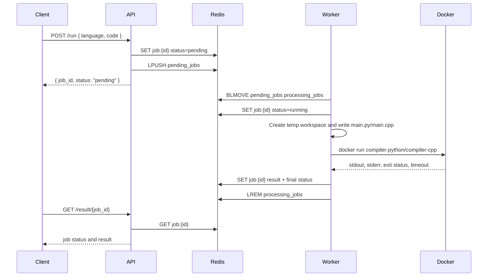

# Code Compiler

> An execution service for running Python and C++ submissions in isolated Docker sandboxes.

## Overview

This is a small distributed online judge(Like leetcode or hackrank or codeforces) style execution backend. It accepts source code over HTTP, stores jobs in Redis, queues them for asynchronous processing, and runs each submission inside a short-lived Docker container with CPU, memory, process, filesystem, network, and Linux capability restrictions.

The project is intended for learrning how developers build coding platforms, internal code runners and programming practice tools.

## Key Features

| Feature | Details |
| --- | --- |
| HTTP submission API | Submit code to `/run` and receive a job ID. |
| Async result polling | Fetch status and execution output from `/result/{job_id}`. |
| Health endpoint | Reports queue length, capacity, and in-process counters. |
| Redis-backed job storage | Jobs are stored as JSON under `job:{id}` with a 24-hour Redis TTL. |
| Redis-backed FIFO queue | Uses `LPUSH` for enqueue and `BLMOVE RIGHT LEFT` for oldest-first claiming. |
| Worker pool | Worker service starts 4 concurrent workers. |
| Python execution | Runs `python3 main.py` in the `compiler-python` image. |
| C++ execution | Compiles with `g++ main.cpp -o app`, then runs `./app` in the `compiler-cpp` image. |
| Docker sandboxing | Enforces timeout, resource limits, read-only root filesystem, no network, dropped capabilities, and no-new-privileges. |
| Stuck job recovery | Worker scans processing jobs every minute and requeues jobs running longer than 5 minutes. |
| Completed job cleanup | Worker deletes completed Redis job records older than 15 minutes. |

## Getting Started

### Installation

```bash
git clone https://github.com/Dharshan2208/code-compiler.git
cd code-compiler
go mod download
```

### Environment Variables

Create a `.env` file for local development if Redis is not running at the default address:

```bash
REDIS_ADDR=localhost:6379
```

### Local Development Setup

Build the sandbox images expected by the executors:

```bash
docker build -t compiler-python -f docker/python/Dockerfile docker/python
docker build -t compiler-cpp -f docker/cpp/Dockerfile docker/cpp
```

Start Redis:

```bash
docker run --rm --name code-compiler-redis -p 6379:6379 redis:7-alpine
```

In one terminal, run the API:

```bash
go run ./cmd/api
```

In another terminal, run the worker:

```bash
go run ./cmd/worker
```

## Configuration

| Variable | Required | Default | Used by | Description |
| --- | --- | --- | --- | --- |
| `REDIS_ADDR` | No | `localhost:6379` | API, worker | Redis server address used by `redis/go-redis/v9`. Docker Compose sets this to `redis:6379`. |

## Running the Project

### Development Mode

```bash
docker build -t compiler-python -f docker/python/Dockerfile docker/python
docker build -t compiler-cpp -f docker/cpp/Dockerfile docker/cpp
docker run --rm --name code-compiler-redis -p 6379:6379 redis:7-alpine
go run ./cmd/api
go run ./cmd/worker
```

### Production Mode

Build standalone binaries:

```bash
go build -o bin/api ./cmd/api
go build -o bin/worker ./cmd/worker
```

Run them with access to Redis and Docker:

```bash
REDIS_ADDR=localhost:6379 ./bin/api
REDIS_ADDR=localhost:6379 ./bin/worker
```

### Docker Setup

Build the service image:

```bash
docker build -t code-compiler .
```

Build required sandbox images:

```bash
docker build -t compiler-python -f docker/python/Dockerfile docker/python
docker build -t compiler-cpp -f docker/cpp/Dockerfile docker/cpp
```

Run the API container:

```bash
docker run --rm -p 8080:8080 -e REDIS_ADDR=host.docker.internal:6379 code-compiler /bin/api
```

Run the worker container with Docker socket and workspace access:

```bash
docker run --rm \
  -e REDIS_ADDR=host.docker.internal:6379 \
  -v /var/run/docker.sock:/var/run/docker.sock \
  -v /app/temp:/app/temp \
  code-compiler /bin/worker
```

### Docker Compose Setup

The included Compose file runs Redis, API, and worker services:

```bash
docker build -t compiler-python -f docker/python/Dockerfile docker/python
docker build -t compiler-cpp -f docker/cpp/Dockerfile docker/cpp
mkdir -p /app/temp
docker compose up --build
```

> The current `docker-compose.yml` mounts `/app/temp:/app/temp`. This absolute host path must exist because the worker uses the host Docker engine through `/var/run/docker.sock`, and sandbox containers need to see the same workspace path.

## API Documentation

### `POST /run`

Submits a code execution job. The handler does not currently enforce HTTP methods, but clients should use `POST`.

| Field | Value |
| --- | --- |
| Route | `/run` |
| Request content type | `application/json` |
| Supported `language` values | `python`, `cpp` |
| Success status | `200 OK` |
| Queue full status | `429 Too Many Requests` |
| Invalid JSON status | `400 Bad Request` |

Request body:

```json
{
  "language": "python",
  "code": "print(\"Hello from Python\")"
}
```

Response example:

```json
{
  "job_id": "6d9b58ec-d381-4af4-a837-80aa3e13a8c9",
  "status": "pending"
}
```

### `GET /result/{job_id}`

Returns the current job state and, once finished, the execution result. The handler does not currently enforce HTTP methods, but clients should use `GET`.

| Field | Value |
| --- | --- |
| Route | `/result/{job_id}` |
| Success status | `200 OK` |
| Missing job status | `404 Not Found` |
| Possible job statuses | `pending`, `running`, `completed`, `failed`, `timeout`, `compile_error`, `runtime_error` |

Response example for a completed Python job:

```json
{
  "id": "6d9b58ec-d381-4af4-a837-80aa3e13a8c9",
  "language": "python",
  "status": "completed",
  "created_at": "2026-06-06T16:15:00.000000000Z",
  "claimed_at": "2026-06-06T16:15:01.000000000Z",
  "completed_at": "2026-06-06T16:15:01.120000000Z",
  "result": {
    "stdout": "Hello from Python\n",
    "stderr": "",
    "status": "success",
    "language": "python",
    "execution_time_ms": 120
  }
}
```

Response example for a C++ compile error:

```json
{
  "id": "f1f8f70e-e765-42cc-86f0-d2189b871029",
  "language": "cpp",
  "status": "compile_error",
  "created_at": "2026-06-06T16:15:00.000000000Z",
  "claimed_at": "2026-06-06T16:15:01.000000000Z",
  "completed_at": "2026-06-06T16:15:01.090000000Z",
  "result": {
    "stdout": "",
    "stderr": "main.cpp: error output from g++",
    "status": "compile_error",
    "language": "cpp",
    "execution_time_ms": 0
  }
}
```

### `GET /health`

Returns service health, Redis queue length, queue capacity, and in-memory counters for the current process. The handler does not currently enforce HTTP methods, but clients should use `GET`.

| Field | Value |
| --- | --- |
| Route | `/health` |
| Success status | `200 OK` |

Response example:

```json
{
  "status": "ok",
  "queue_length": 0,
  "queue_capacity": 100,
  "submitted_jobs": 3,
  "completed_jobs": 0,
  "failed_jobs": 0
}
```

## Workflow


## TODO

- Have to deploy this project in a vps
- Have to make a frontend for this 
- Implement more language support like c,java,go and more
- More better code or architecture