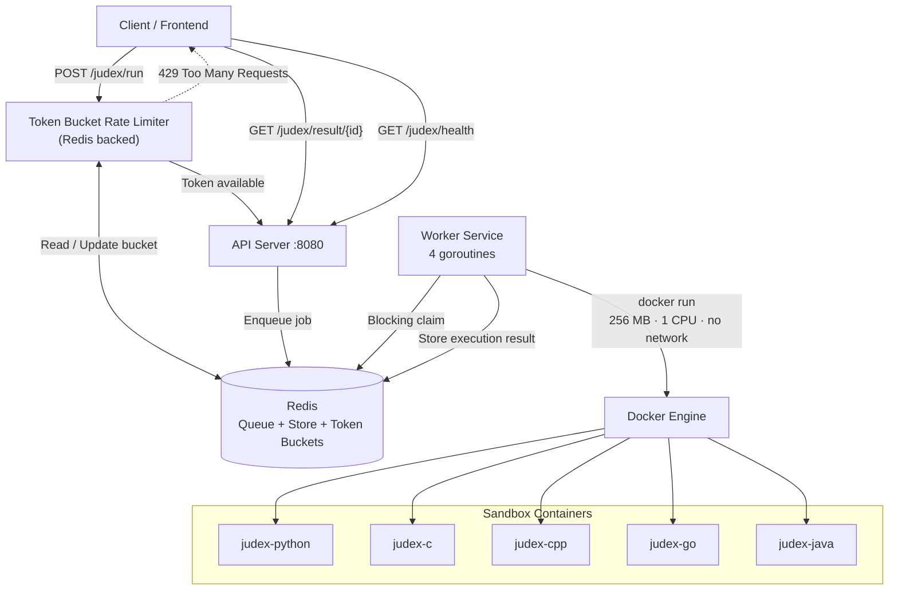
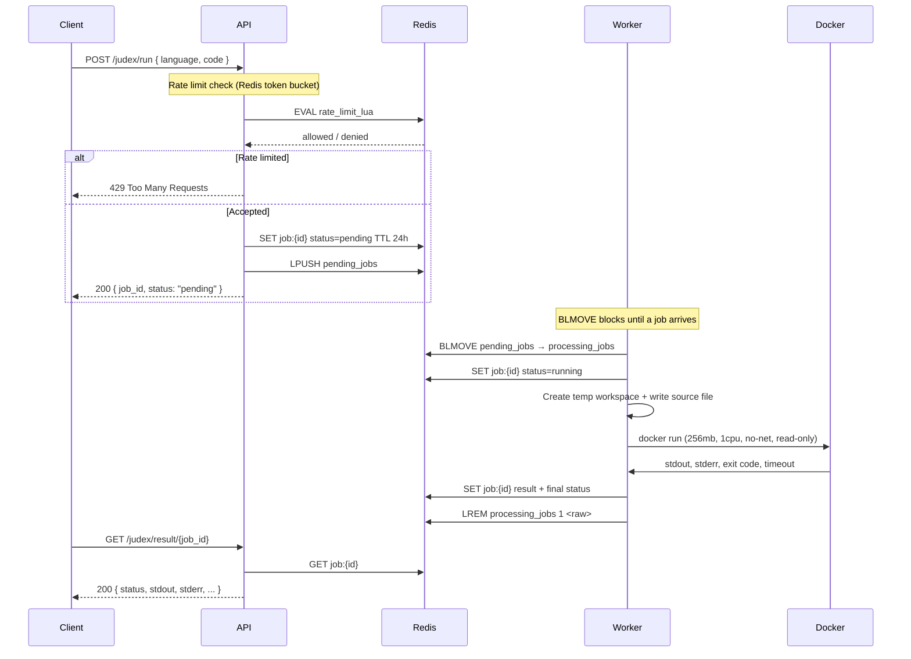

# Judex

> A distributed, multi-language code execution engine with Docker based sandbox isolation. Inspired by platforms like LeetCode, HackerRank, and Codeforces.

## Architecture


```mermaid
flowchart TD
    Client["Client / Frontend"]

    RateLimiter["Token Bucket Rate Limiter<br/>(Redis backed)"]

    API["API Server :8080"]
    Worker["Worker Service<br/>4 goroutines"]

    Redis[("Redis<br/>Queue + Store + Token Buckets")]

    Docker["Docker Engine"]

    subgraph Sandbox["Sandbox Containers"]
        Python["judex-python"]
        C["judex-c"]
        CPP["judex-cpp"]
        Go["judex-go"]
        Java["judex-java"]
    end

    Client -->|"POST /judex/run"| RateLimiter
    RateLimiter -->|"Token available"| API
    RateLimiter -.->|"429 Too Many Requests"| Client

    Client -->|"GET /judex/result/{id}"| API
    Client -->|"GET /judex/health"| API

    RateLimiter <-->|"Read / Update bucket"| Redis

    API -->|"Enqueue job"| Redis

    Worker -->|"Blocking claim"| Redis
    Worker -->|"Store execution result"| Redis

    Worker -->|"docker run<br/>256 MB · 1 CPU · no network"| Docker

    Docker --> Python
    Docker --> C
    Docker --> CPP
    Docker --> Go
    Docker --> Java
```

## Overview

This is a small but production oriented **online judge execution backend**. It accepts source code via HTTP requests, queues each submission in Redis, and processes them asynchronously using worker services. Each job is picked up from the queue and executed inside a short lived, heavily restricted Docker container with strict CPU, memory, filesystem, process, and network limitations to ensure isolation and security.

This project is intended for learning how real world coding platforms and internal code execution systems are built with concepts like distributed job queues, sandboxing, containerized execution, concurrency, and rate limited request handling in a scalable architecture.

## How It Works


```mermaid
sequenceDiagram
    participant Client
    participant API
    participant Redis
    participant Worker
    participant Docker

    Client->>API: POST /judex/run { language, code }

    Note over API: Rate limit check (Redis token bucket)
    API->>Redis: EVAL rate_limit_lua
    Redis-->>API: allowed / denied

    alt Rate limited
        API-->>Client: 429 Too Many Requests
    else Accepted
        API->>Redis: SET job:{id} status=pending TTL 24h
        API->>Redis: LPUSH pending_jobs
        API-->>Client: 200 { job_id, status: "pending" }
    end

    Note over Worker: BLMOVE blocks until a job arrives
    Worker->>Redis: BLMOVE pending_jobs → processing_jobs
    Worker->>Redis: SET job:{id} status=running

    Worker->>Worker: Create temp workspace + write source file
    Worker->>Docker: docker run (256mb, 1cpu, no-net, read-only)

    Docker->>Worker: stdout, stderr, exit code, timeout
    Worker->>Redis: SET job:{id} result + final status
    Worker->>Redis: LREM processing_jobs 1 <raw>

    Client->>API: GET /judex/result/{job_id}
    API->>Redis: GET job:{id}
    API-->>Client: 200 { status, stdout, stderr, ... }
```

## Key Features

| Feature | Details |
|---|---|
| **HTTP API** | Submit code to `/judex/run`, poll results from `/judex/result/{id}`, check heh at `/judex/health` |
| **Async processing** | Jobs are queued in Redis and processed by a pool of background workers |
| **Redis backed queue** | FIFO ordering via `LPUSH` / blocking `BLMOVE` with atomic claim semantics |
| **Redis job store** | Full job state persisted as JSON with 24-hour TTL |
| **Redis rate limiter** | Distributed token bucket (10 burst, 1/sec refill) via Lua script — survives restarts and scales across instances |
| **Docker sandbox** | Each execution runs in a fresh container with 256 MB RAM, 1 CPU, no network, read-only rootfs, no capabilities, and `no-new-privileges` |
| **Multi-language** | Python, C, C++, Go, and Java |
| **Stuck job recovery** | Periodic scan requeues jobs claimed for >5 minutes |
| **Completed job cleanup** | Background goroutine deletes finished job records older than 15 minutes |
| **Horizontal scaling** | Stateless API; add more instances behind a load balancer. Rate limiter and queue are shared via Redis |

## Tech Stack

| Layer | Technology |
|---|---|
| Language | Go 1.25 |
| HTTP | `net/http` (stdlib) |
| Queue & Store | Redis 7 (via `go-redis/redis/v9`) |
| Sandbox | Docker (sibling containers via `/var/run/docker.sock`) |
| Deployment | Docker Compose |

## Getting Started

### Prerequisites

- Go 1.25+
- Docker (for sandbox execution)
- Redis 7+ (or the Docker image)

### Clone

```bash
git clone https://github.com/Dharshan2208/judex.git
cd judex
go mod download
```

### Build Sandbox Images

```bash
make images
```

### Start Redis

```bash
docker run --rm --name judex-redis -p 6379:6379 redis:7-alpine
```


## Configuration

| Variable | Required | Default | Used by | Description |
|---|---|---|---|---|
| `REDIS_ADDR` | No | `localhost:6379` | API, Worker | Redis server address. Docker Compose sets this to `redis:6379` automatically |

Create a `.env` file to override:

```bash
REDIS_ADDR=my-redis-host:6379
```

## Running Modes

### Development (standalone binaries)

```bash
# Terminal 1 — API
make run-api

# Terminal 2 — Worker
make run-worker
```

### Production (standalone binaries)

```bash
go build -o bin/api ./cmd/api
go build -o bin/worker ./cmd/worker

REDIS_ADDR=localhost:6379 ./bin/api
REDIS_ADDR=localhost:6379 ./bin/worker
```

### Docker Compose

```bash
make up
```

> The `docker-compose.yml` mounts `/app/temp:/app/temp` because the worker uses the host Docker engine through `/var/run/docker.sock`. Sandbox containers need to see the same workspace path.

## API Documentation

### `POST /run`

Submit a code execution job.

| Field | Value |
|---|---|
| Route | `/run` |
| Content-Type | `application/json` |

```json
{
  "language": "python",
  "code": "print(\"Hello from Python\")"
}
```

```json
{
  "job_id": "6d9b58ec-d381-4af4-a837-80aa3e13a8c9",
  "status": "pending"
}
```

### `GET /judex/result/{job_id}`

Poll for job status and execution output.

| Field | Value |
|---|---|
| Route | `/judex/result/{job_id}` |
| Status values | `pending`, `running`, `completed`, `failed`, `timeout`, `compile_error`, `runtime_error` |

**Completed Python job:**

```json
{
  "id": "6d9b58ec-d381-4af4-a837-80aa3e13a8c9",
  "language": "python",
  "status": "completed",
  "created_at": "2026-06-06T16:15:00.000000000Z",
  "claimed_at": "2026-06-06T16:15:01.000000000Z",
  "completed_at": "2026-06-06T16:15:01.120000000Z",
  "result": {
    "stdout": "Hello from Python\n",
    "stderr": "",
    "status": "success",
    "language": "python",
    "execution_time_ms": 120
  }
}
```

**C++ compile error:**

```json
{
  "id": "f1f8f70e-e765-42cc-86f0-d2189b871029",
  "language": "cpp",
  "status": "compile_error",
  "created_at": "2026-06-06T16:15:00.000000000Z",
  "claimed_at": "2026-06-06T16:15:01.000000000Z",
  "completed_at": "2026-06-06T16:15:01.090000000Z",
  "result": {
    "stdout": "",
    "stderr": "main.cpp: error output from g++",
    "status": "compile_error",
    "language": "cpp",
    "execution_time_ms": 0
  }
}
```

### `GET /judex/health`

Service health and queue metrics.

| Field | Value |
|---|---|
| Route | `/health` |
| Success | `200 OK` |

```json
{
  "status": "ok",
  "queue_length": 0,
  "queue_capacity": 100,
  "submitted_jobs": 3,
  "completed_jobs": 0,
  "failed_jobs": 0
}
```

## Rate Limiting

The `/judex/run` endpoint is protected by a **distributed token bucket** implemented as a Redis Lua script:

- **Capacity**: 10 tokens (burst of 10 requests)
- **Refill rate**: 1 token per second (sustained throughput)
- **Scope**: Per client IP
- **Storage**: Redis Hash key `ratelimit:{ip}` with 30 minute TTL
- **Atomicity**: The entire check-and-consume runs inside a single Lua script on Redis — safe across multiple API instances

Because the state lives in Redis, rate limits survive API restarts and work correctly behind a load balancer with multiple API replicas.

## Sandbox Security

Each execution runs in a Docker container with the following restrictions:

| Constraint | Value |
|---|---|
| Memory | 256 MB (`--memory=256m`) |
| CPU | 1 core (`--cpus=1`) |
| Processes | 64 max (`--pids-limit=64`) |
| Network | None (`--network=none`) |
| Filesystem | Read-only root (`--read-only`) |
| Temp | 64 MB tmpfs at `/tmp` |
| Privileges | None (`--security-opt=no-new-privileges`) |
| Capabilities | All dropped (`--cap-drop=ALL`) |
| Timeout | 10 seconds (context deadline) |

## TODO

- [ ] Deploy to a VPS
- [ ] Build a frontend