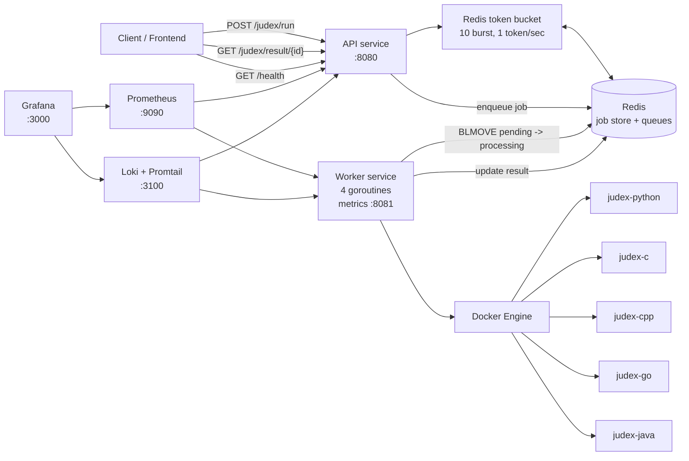
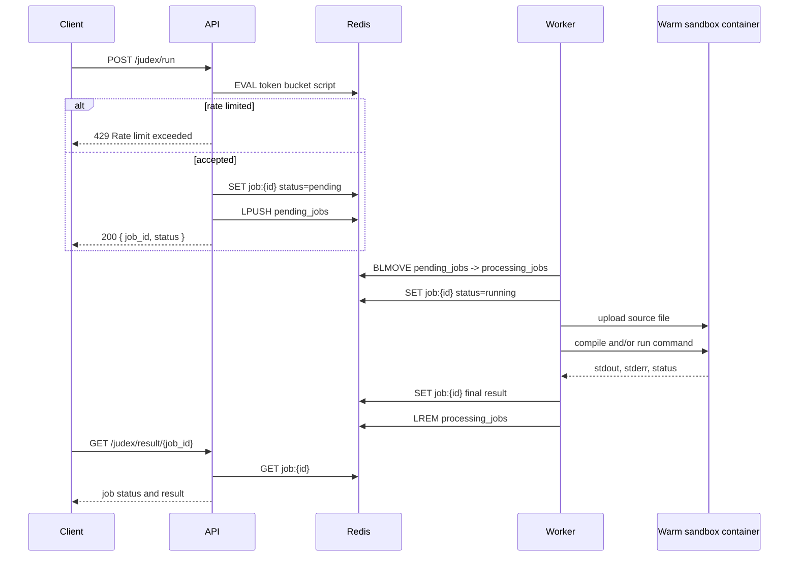

# Judex

[](https://go.dev/)
[](https://redis.io/)
[](https://www.docker.com/)
[](https://prometheus.io/)
[](https://grafana.com/)

Judex is a small distributed code execution backend for online judge style systems. It accepts source code over HTTP, queues submissions in Redis, and executes them asynchronously inside restricted Docker sandboxes for Python, C, C++, Go, and Java.

The project is useful as a reference implementation for building the backend pieces behind coding platforms: API submission, queueing, worker pools, container isolation, rate limiting, structured logs, metrics, and local observability.

> **Security note**
> Judex is designed as a learning and development project, not a hardened multi-tenant sandbox. Review the Docker isolation model, host Docker socket exposure, resource limits, and operational controls before running untrusted code in production.

## Table of Contents

- [Features](#features)
- [Architecture](#architecture)
- [Project Structure](#project-structure)
- [Prerequisites](#prerequisites)
- [Quick Start](#quick-start)
- [Configuration](#configuration)
- [API Reference](#api-reference)
- [Docker Setup](#docker-setup)
- [Observability](#observability)
- [Development](#development)
- [Testing](#testing)

## Features

- Asynchronous submission flow with a Redis-backed pending and processing queue.
- API and worker services that can be scaled independently.
- Warm Docker container pools per language to avoid creating a fresh container for every job.
- Redis-backed distributed token bucket rate limiting for submission requests.
- Per-job result storage in Redis with JSON status records.
- Stuck job recovery for jobs left in the processing queue.
- Completed job cleanup in the worker process.
- Prometheus metrics for HTTP and execution timings.
- Docker Compose stack for Redis, API, worker, Prometheus, Grafana, Loki, and Promtail.

## Architecture


```mermaid
flowchart LR
    Client["Client / Frontend"]
    API["API service<br/>:8080"]
    RateLimit["Redis token bucket<br/>10 burst, 1 token/sec"]
    Redis[("Redis<br/>job store + queues")]
    Worker["Worker service<br/>4 goroutines<br/>metrics :8081"]
    Docker["Docker Engine"]
    Metrics["Prometheus<br/>:9090"]
    Logs["Loki + Promtail<br/>:3100"]
    Grafana["Grafana<br/>:3000"]

    Client -->|"POST /judex/run"| API
    Client -->|"GET /judex/result/{id}"| API
    Client -->|"GET /health"| API

    API --> RateLimit
    RateLimit <--> Redis
    API -->|"enqueue job"| Redis

    Worker -->|"BLMOVE pending -> processing"| Redis
    Worker -->|"update result"| Redis
    Worker --> Docker

    Docker --> Python["judex-python"]
    Docker --> C["judex-c"]
    Docker --> CPP["judex-cpp"]
    Docker --> Go["judex-go"]
    Docker --> Java["judex-java"]

    Metrics --> API
    Metrics --> Worker
    Logs --> API
    Logs --> Worker
    Grafana --> Metrics
    Grafana --> Logs
```

### Execution Flow


```mermaid
sequenceDiagram
    participant Client
    participant API
    participant Redis
    participant Worker
    participant Sandbox as Warm sandbox container

    Client->>API: POST /judex/run
    API->>Redis: EVAL token bucket script

    alt rate limited
        API-->>Client: 429 Rate limit exceeded
    else accepted
        API->>Redis: SET job:{id} status=pending
        API->>Redis: LPUSH pending_jobs
        API-->>Client: 200 { job_id, status }
    end

    Worker->>Redis: BLMOVE pending_jobs -> processing_jobs
    Worker->>Redis: SET job:{id} status=running
    Worker->>Sandbox: upload source file
    Worker->>Sandbox: compile and/or run command
    Sandbox-->>Worker: stdout, stderr, status
    Worker->>Redis: SET job:{id} final result
    Worker->>Redis: LREM processing_jobs

    Client->>API: GET /judex/result/{job_id}
    API->>Redis: GET job:{id}
    API-->>Client: job status and result
```

### Sandbox Model

The worker creates warm containers for every supported language during startup. Jobs borrow a container from the language pool, upload source into `/workspace`, execute the configured compile/run command, then sanitize the container before returning it to the pool.

Current sandbox settings:

| Setting | Value |
| --- | --- |
| Container user | `1000` |
| Memory limit | `256 MiB` |
| CPU limit | `1 CPU` |
| PID limit | `64` |
| Network | disabled (`none`) |
| Linux capabilities | dropped (`ALL`) |
| Security option | `no-new-privileges` |
| Per-job context timeout | `30s` |

## Project Structure

```text
.
├── cmd/
│   ├── api/                  # HTTP API entrypoint
│   └── worker/               # worker service entrypoint
├── docker/                   # sandbox images for each language
│   ├── c/
│   ├── cpp/
│   ├── go/
│   ├── java/
│   └── python/
├── internal/
│   ├── app/                  # application wiring
│   ├── cleanup/              # completed job cleanup
│   ├── executor/             # language-specific compile/run logic
│   ├── handler/              # HTTP handlers
│   ├── limiter/              # Redis Lua token bucket
│   ├── middleware/           # CORS, logging, metrics, request IDs
│   ├── metrics/              # Prometheus collectors
│   ├── queue/                # Redis queue and recovery logic
│   ├── sandbox/              # Docker warm container pool
│   ├── store/                # Redis job storage
│   └── worker/               # worker pool and job processor
├── tests/                    # shared test helpers
├── docker-compose.yml        # local runtime and observability stack
├── prometheus.yml            # Prometheus scrape config
├── loki-config.yaml          # Loki config
├── promtail-config.yaml      # Promtail Docker log discovery
├── Dockerfile                # API/worker service image
└── Makefile                  # common development commands
```

## Prerequisites

- Go 1.25+
- Docker Engine with access to `/var/run/docker.sock`
- Docker Compose v2
- Redis 7+ if running services outside Compose
- `make`
- Optional: `golangci-lint` for `make lint`

## Quick Start

Clone the repository and install Go dependencies:

```bash
git clone https://github.com/Dharshan2208/judex.git
cd judex
go mod download
```

Build the language sandbox images:

```bash
make images
```

Start Redis:

```bash
docker run --rm --name judex-redis -p 6379:6379 redis:7-alpine
```

Start the API and worker in separate terminals:

```bash
make run-api
```

```bash
make run-worker
```

Submit a Python job:

```bash
curl -sS -X POST http://localhost:8080/judex/run \
  -H 'Content-Type: application/json' \
  -d '{"language":"python","code":"print(\"hello from judex\")"}'
```

Poll the result:

```bash
curl -sS http://localhost:8080/judex/result/<job_id>
```

## Configuration

Judex reads environment variables directly and also attempts to load a local `.env` file.

| Variable | Default | Used by | Description |
| --- | --- | --- | --- |
| `REDIS_ADDR` | `localhost:6379` | API, worker | Redis address. Compose sets this to `redis:6379`. |

Example `.env`:

```env
REDIS_ADDR=localhost:6379
```

The following values are currently hard-coded in the application:

| Setting | Value | Location |
| --- | --- | --- |
| API port | `8080` | `cmd/api/main.go` |
| Worker metrics port | `8081` | `cmd/worker/main.go` |
| Worker count | `4` | `internal/app/app.go` |
| Queue capacity | `1000` | `internal/app/app.go` |
| Rate limit | burst `10`, refill `1/sec` | `cmd/api/main.go` |
| Redis job TTL | `24h` | `internal/store/redis_store.go` |
| Completed job cleanup age | `15m` | `cmd/worker/main.go` |
| Stuck job recovery age | `5m` | `cmd/worker/main.go` |

## API Reference

### `POST /judex/run`

Submit a source file for asynchronous execution.

Request:

```json
{
  "language": "python",
  "code": "print(\"hello from judex\")"
}
```

Supported `language` values:

| Language | Value | Source filename |
| --- | --- | --- |
| Python | `python` | `main.py` |
| C | `c` | `main.c` |
| C++ | `cpp` | `main.cpp` |
| Go | `go` | `main.go` |
| Java | `java` | `Main.java` |

Response:

```json
{
  "job_id": "6d9b58ec-d381-4af4-a837-80aa3e13a8c9",
  "status": "pending"
}
```

Possible errors:

| Status | Reason |
| --- | --- |
| `400` | Invalid JSON body |
| `405` | Method is not `POST` |
| `429` | Rate limit exceeded or queue full |

### `GET /judex/result/{job_id}`

Fetch job state and execution output.

```bash
curl -sS http://localhost:8080/judex/result/6d9b58ec-d381-4af4-a837-80aa3e13a8c9
```

Example completed response:

```json
{
  "id": "6d9b58ec-d381-4af4-a837-80aa3e13a8c9",
  "language": "python",
  "status": "completed",
  "created_at": "2026-07-05T12:00:00Z",
  "claimed_at": "2026-07-05T12:00:01Z",
  "completed_at": "2026-07-05T12:00:01Z",
  "result": {
    "stdout": "hello from judex\n",
    "stderr": "",
    "status": "success",
    "language": "python",
    "execution_time_ms": 42
  }
}
```

Possible job statuses:

| Status | Meaning |
| --- | --- |
| `pending` | Accepted and waiting in the queue |
| `running` | Claimed by a worker |
| `completed` | Execution finished successfully |
| `compile_error` | Compilation failed for a compiled language |
| `runtime_error` | Runtime execution failed |
| `timeout` | Execution exceeded the active timeout path |
| `internal_error` | Worker or sandbox setup failed |
| `unsupported language` | No executor exists for the submitted language |

Possible HTTP errors:

| Status | Reason |
| --- | --- |
| `404` | Job ID was not found or has expired/been cleaned up |
| `405` | Method is not `GET` |

### `GET /health`

Return API process health and queue counters.

```bash
curl -sS http://localhost:8080/health
```

```json
{
  "status": "ok",
  "queue_length": 0,
  "queue_capacity": 1000,
  "submitted_jobs": 1,
  "completed_jobs": 0,
  "failed_jobs": 0
}
```

### `GET /judex/metrics`

Expose Prometheus metrics.

```bash
curl -sS http://localhost:8080/judex/metrics
curl -sS http://localhost:8081/judex/metrics
```

## Docker Setup

Run the full local stack:

```bash
make up
```

Stop it:

```bash
make down
```

Compose starts:

| Service | Port | Purpose |
| --- | --- | --- |
| `api` | `8080` | Judex HTTP API |
| `worker` | `8081` | Worker Prometheus metrics |
| `redis` | `6379` | Queue, job store, rate limiter |
| `prometheus` | `9090` | Metrics scraping |
| `grafana` | `3000` | Dashboards and log exploration |
| `loki` | `3100` | Log storage |
| `promtail` | `9080` internal | Docker log discovery and shipping |

The worker mounts `/var/run/docker.sock` so it can create sibling sandbox containers on the host Docker engine. It also mounts `/app/temp:/app/temp`, although current code uploads source directly into warm containers through the Docker API.

Before running only the worker outside Compose, build sandbox images locally:

```bash
make images
```

## Observability

Prometheus scrapes:

- API metrics from `api:8080/judex/metrics`
- Worker metrics from `worker:8081/judex/metrics`

Application metrics currently include:

| Metric | Labels | Description |
| --- | --- | --- |
| `judex_request_duration_seconds` | `endpoint`, `status` | HTTP request latency |
| `judex_execution_duration_seconds` | `language` | Total language execution latency |
| `judex_compile_duration_seconds` | `language` | Compile step latency |
| `judex_run_duration_seconds` | `language` | Run step latency |

Promtail discovers Docker containers through the Docker socket and ships logs to Loki with labels such as `service`, `container_name`, and `compose_project`.

Grafana is available at:

```text
http://localhost:3000
```

## Development

Common commands:

```bash
make help
make images
make run-api
make run-worker
make test
make vet
make lint
make clean
```

Build production binaries locally:

```bash
go build -o bin/api ./cmd/api
go build -o bin/worker ./cmd/worker
```

Run them:

```bash
REDIS_ADDR=localhost:6379 ./bin/api
```

```bash
REDIS_ADDR=localhost:6379 ./bin/worker
```

### Adding a Language

1. Add a sandbox image under `docker/<language>/Dockerfile`.
2. Add the image name to `IMAGES` in `Makefile`.
3. Register the language-to-image mapping in `internal/app/app.go`.
4. Implement an executor in `internal/executor/`.
5. Add the language case in `Worker.getExecutor`.
6. Add tests for executor behavior and handler/worker integration.
7. Update this README's supported language table.

## Testing

Run the full Go test suite with race detection:

```bash
make test
```

Run `go vet`:

```bash
make vet
```

Run linting, if `golangci-lint` is installed:

```bash
make lint
```

The test suite uses helpers under `tests/`, including Redis test helpers and fake Docker behavior for sandbox-adjacent tests.

## License

This project is licensed under the AGPL-3.0 License. See [LICENSE](LICENSE) for details.


